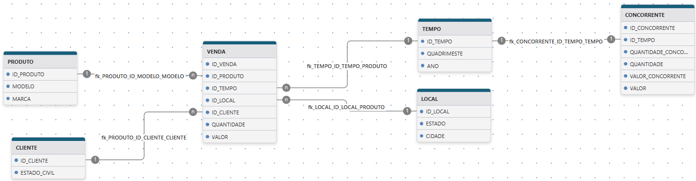

# Descrição do Trabalho

A empresa “Mimi Phones” atua na comercialização (venda) de telefones celulares, possuindo no seu
catálogo dezenas de modelos de smartphones, dos mais variados fabricantes. Ela possui um banco de
dados transacional contendo informações sobre os aparelhos comercializados, clientes e as vendas dos
últimos 5 anos. O modelo de dados pode ser visto na figura abaixo.

Com o propósito de melhorar a gestão da empresa, os diretores decidiram solicitar a equipe de TI a
construção de uma solução de BI, através da construção de um data Warehouse e do uso de consultas
analíticas e ferramentas de visualização de dados, de forma que possam:

- Visualizar a quantidade e o valor comprado pelos modelos e/ou marcas dos seus produtos;
- Visualizar a quantidade e o valor comprado dos seus produtos, geograficamente, pelas cidades
  e/ou estados;
- Visualizar a quantidade e o valor comprado dos seus produtos, por quadrimestre e/ou por ano;
- Visualizar a quantidade e o valor comprado dos seus produtos, por estado civil.
- Visualizar o ranking dos smartphones mais vendidos em um determinado ano;
- Visualizar o ranking dos smartphones com maior valor de venda por estado, em um determinado
  ano;
- Visualizar o percentual de venda de cada smartphone em um determinado quadrimestre e ano;

Vale salientar que um funcionário da TI chamou a atenção para duas inconsistências observadas por ele:

- A mesma cidade foi cadastrada duas vezes (Salvador e SSA, Rio de Janeiro e RJ e São Paulo e
  SP);
- Alguns clientes possuem nomenclatura diferente para o atributo sexo. Ao invés de ‘M’, aparece
  2 e ao invés de ‘F’ aparece 1.

**Observações**:

Prezar pela otimização no que tange a modelagem, processamento e o armazenamento de
dados;

Os scripts do banco de dados OLTP da empresa estão disponíveis no ambiente virtual de
aprendizagem (Canvas), como também os arquivos complementares.

Supor que os dados disponibilizados no banco OLTP são apenas uma pequena parte da base
de dados muito maior, isto quer dizer, que é deve ser feito nenhum trabalho manual. Deve-se
usar scripts de banco de dados procedimentos automatizados.

# Modelo de dados OLAP

# Como rodar

1. Crie os schemas `dw_oltp` e `dw_olap`.
2. Crie e popule o BD OLTP executando os scripts da pasta `scripts_oltp` na ordem especificada pelo nome dos arquivos.
3. Crie o BD OLAP executando o script `create_olap_db.sql`.
4. Popule o BD OLAP com os dados do BD OLTP executando o comando `python populate_olap_db.py`.
